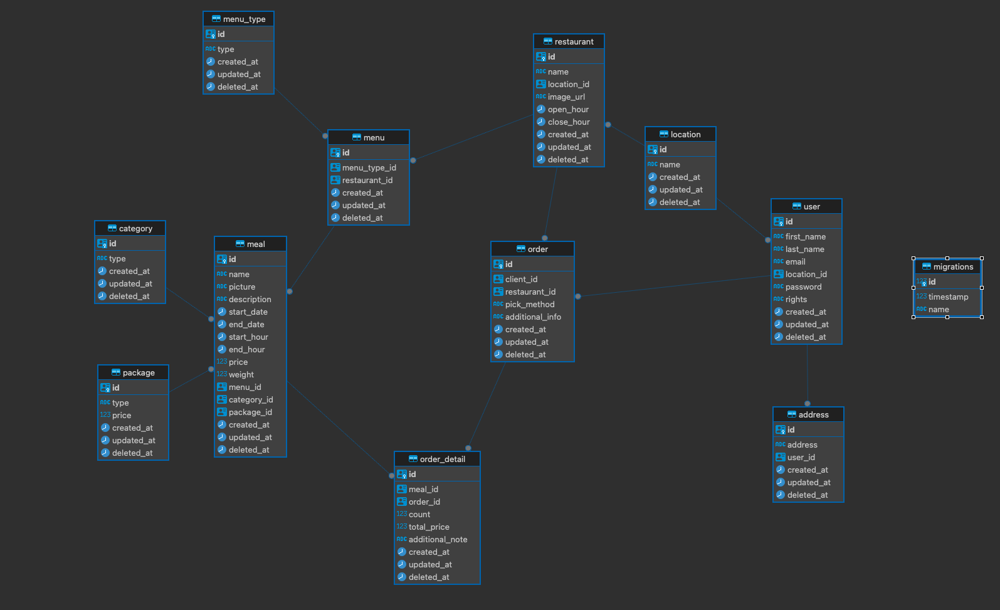

# Restaurant Management App
This is backend repository for the Restaurant Management Application, system developed to provide an easy manageable food orders from various restaurants located all over the country and as part of the Yara Internship Program. The backend is built using NestJS and PostgreSQL database.

## Getting Started

1. Clone the Repository:
   https://github.com/DimitarMitev92/restaurant-back-end-nestjs.git

2. Install dependencies:
   npm install (we highly recommend to use npm)

3. Database Setup:
   Create a PostgreSQL database and update the connection details in the .env file as follows:
  ### .env
| Key                    | Value                   |
|------------------------|-------------------------|
| `PORT`                 | `8080`                  |
| `DB_HOST`              | `localhost`             |
| `DB_PORT`              | `5432` /or different /  |
| `DB_USERNAME`          | `postgres`              |
| `DB_PASSWORD`          | `your-password`         |
| `DB_DATABASE`          | `name-of-your-database` |
| `JWT_SECRET`           | `secret-expression`     |
| `AWS_BUCKET_NAME`      | `db-name`               |
| `AWS_REGION`           | `your-region`           |
| `AWS_ACCESS_KEY_ID`    | `license key`           |
| `AWS_SECRET_ACCESS_KEY`| `access-token`          |

4. Migrations:
 To create all tables in the DB first you have to run the migrations:
  - npm run:migration run

5. Run the Application:
The server will be running at http://localhost:8080 /or different/
  - npm run start:dev
   

## Features

Database Design: PostgreSQL database is used to store:

- location
- restaurant
- menu
- menu_type
- meal
- package
- category
- order
- order_details
- user
- address

See attachment

Authentication: Admins can add/update/remove restaurants, set up menu and meal and all other data.
JWT Access Token required.
Additional Functionalities: Change password, categorize meals, add notes to meals in the order, view order history, and copy previous orders.
Validation: Orders limited to restaurants in the user's location, minimum total sum for delivery orders.
Reporting: Order details containing data for date, time, total price and meals in the order.

## Libraries

## Production Dependencies:

| Package                          | Version             |
|----------------------------------|---------------------|
| `@aws-sdk/lib-storage`           | `3.514.0`           |
| `@nestjs/common`                 | `10.0.0`            |
| `@nestjs/config`                 | `3.2.0`             |
| `@nestjs/core`                   | `10.0.0`            |
| `@nestjs/jwt`                    | `10.2.0`            |
| `@nestjs/mapped-types`           | Not specified       |
| `@nestjs/platform-express`       | `10.3.3`            |
| `@nestjs/typeorm`                | `10.0.2`            |
| `bcrypt`                         | `5.1.1`             |
| `class-transformer`              | `0.5.1`             |
| `class-validator`                | `0.14.1`            |
| `dotenv`                         | `16.4.4`            |
| `express`                        | `4.18.2`            |
| `moment-timezone`                | `0.5.45`            |
| `pg`                             | `8.11.3`            |
| `reflect-metadata`               | `0.1.13`            |
| `rxjs`                           | `7.8.1`             |
| `typeorm`                        | `0.3.20`            |

## Development Dependencies:

| Package                             | Version    |
|-------------------------------------|------------|
| `@nestjs/cli`                       | `10.0.0`   |
| `@nestjs/schematics`                | `10.0.0`   |
| `@nestjs/testing`                   | `10.0.0`   |
| `@types/express`                    | `4.17.21`  |
| `@types/jest`                       | `29.5.2`   |
| `@types/multer`                     | `1.4.11`   |
| `@types/node`                       | `20.3.1`   |
| `@types/supertest`                  | `6.0.0`    |
| `@typescript-eslint/eslint-plugin`  | `6.0.0`    |
| `@typescript-eslint/parser`         | `6.0.0`    |
| `eslint`                            | `8.42.0`   |
| `eslint-config-prettier`            | `9.0.0`    |
| `eslint-plugin-prettier`            | `5.0.0`    |
| `jest`                              | `29.5.0`   |
| `prettier`                          | `3.0.0`    |
| `source-map-support`                | `0.5.21`   |
| `supertest`                         | `6.3.3`    |
| `ts-jest`                           | `29.1.0`   |
| `ts-loader`                         | `9.4.3`    |
| `ts-node`                           | `10.9.1`   |
| `tsconfig-paths`                    | `4.2.0`    |
| `typescript`                        | `5.1.3`    |

## Base Endpoints
| Service         | URL                                             |
|-----------------|-------------------------------------------------|
| USER            | `http://localhost:${PORT}/user`                 |
| SIGN_IN         | `http://localhost:${PORT}/auth/sign-in`         |
| SIGN_UP         | `http://localhost:${PORT}/auth/sign-up`         |
| CHANGE_PASSWORD | `http://localhost:${PORT}/auth/change-password` |
| RESTAURANT      | `http://localhost:${PORT}/restaurant`           |
| MENU            | `http://localhost:${PORT}/menu`                 |
| MENU_TYPE       | `http://localhost:${PORT}/menu-type`            |
| MEAL            | `http://localhost:${PORT}/meal`                 |
| ORDER           | `http://localhost:${PORT}/order`                |
| ORDER_DETAIL    | `http://localhost:${PORT}/order-detail`         |
| CATEGORY        | `http://localhost:${PORT}/category`             |
| LOCATION        | `http://localhost:${PORT}/location`             |
| PACKAGE         | `http://localhost:${PORT}/package`              |
| ADDRESS         | `http://localhost:${PORT}/address`              |

## Team Members
| Name              | GitHub                                 |
|-------------------|----------------------------------------|
| `Radina Georgieva`| `https://github.com/radinag94`         |
| `Ana Popova`      | `https://github.com/AniPopova`         |
| `Petar Georgiev`  | `https://github.com/PetarGeorgiev-hash`|
| `Dimitar Mitev`   | `https://github.com/DimitarMitev92`    |

## Contributing
If you'd like to contribute, please fork the repository and create a pull request. Feel free to contact any team member for collaboration.

## License
This project is licensed under the MIT License - see the LICENSE.md file for details.
